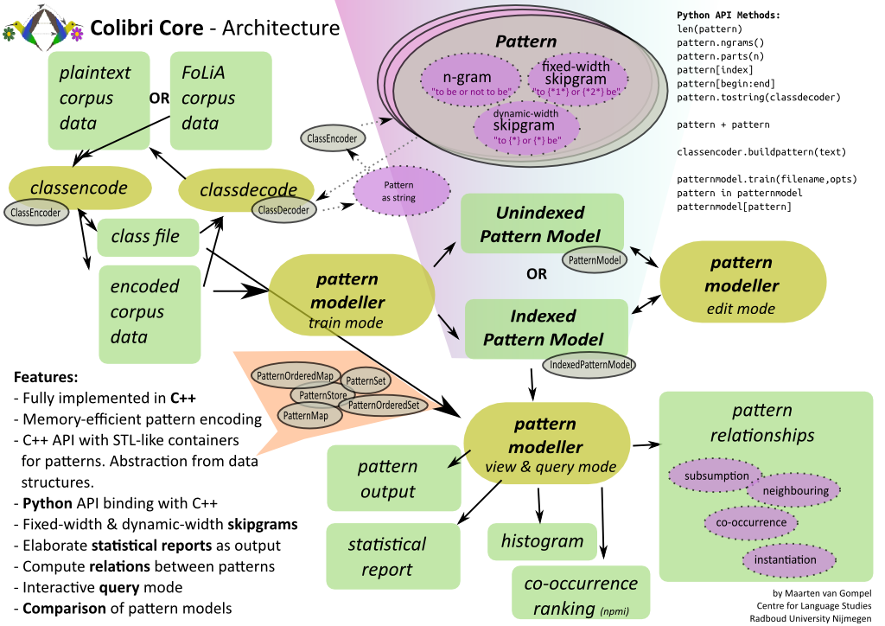

.. colibri documentation master file, created by
   sphinx-quickstart on Mon Oct  8 11:38:12 2012.
   You can adapt this file completely to your liking, but it should at least
   contain the root `toctree` directive.

****************************
Colibri Documentation 
****************************

.. toctree::
   :maxdepth: 3

Introduction
===================

Colibri Core is a set of tools as well as a C++ and Python library for working with basic linguistic constructions such as n-grams and skipgrams (i.e patterns with one or more gaps, either of fixed or dynamic size) in a quick and memory-efficient way. At the core is the tool ``colibri-patternmodeller`` which allows you to build, view, manipulate and query pattern models.

The Colibri software is developed in the scope of the Ph.D. research project **Constructions as Linguistic Bridges**. This research examines the identification and extraction of aligned constructions or patterns across natural languages, and the usage of such constructions in Machine Translation. The aligned constructions are not identified on the basis of an extensive and explicitly defined grammar or expert database of linguistic knowledge, but rather are implicitly distilled from large amounts of example data. Our notion of constructions is broad and transcends the idea of words or variable-length phrases.

This documentation will illustrate how to work with the various tools and the library of colibri, as well as elaborate on the implementation of certain key aspects of the software.

Installation
===============

Colibri is hosted on `github <http://github.com/proycon/colibri-core/>`_ and should be retrieved through the versioning control system ``git``. Provided git is installed on your system, this is done as follows::

	$ git clone http://github.com/proycon/colibri-core.git
	
You need to compile the software, if you want FoLiA support you will need to first to install the following dependency. By default FoLiA support is disabled.

 * **libfolia**; obtainable from `the FoLiA website <http://proycon.github.com/folia>`_,  follow the instructions included with libfolia to install it.

In addition to the C/C++ compiler (``gcc``), the build process for colibri makes use of ``autoconf`` and ``automake``. Make sure these are installed on your system. Also install the package ``autoconf-archive`` if available on your distribution. Colibri can now be compiled and installed::

  $ cd colibri
  $ bash bootstrap
  $ ./configure [--with-folia --with-folia-path=/path/to/libfolia]
  $ make
  $ make install
  
You can optionally pass a prefix if you want to install colibri in a different location::

  $ ./configure --prefix=/usr/local/
  
 
Keeping colibri up to date
-----------------------------

Colibri is always under heavy development. Update your colibri copy by issuing a git pull::

 $ git pull
 
And then recompile as per the above instructions.

General usage instructions
---------------------------------

Colibri consist of various programs, each of which will output an extensive overview of available parameters if the parameter ``-h`` is passed. Each program is designed for a specialised purpose, with specific input and output formats. It is often needed to call multiple programs in succession to obtain the final analysis or model you desire. 

Corpus Class Encoding
================================

Introduction
----------------------

Computation on large datasets begs for solutions to keep memory consumption
manageable. Colibri requires that input corpora are converted into a compressed
binary form. In this form each word-type in the corpus is represented by a
numeric class. Highly frequent word-types get assigned low class numbers and
less frequent word-types get higher class numbers. The class is represented in
a dynamic-width byte-array, rather than a fixed-width integer.Patterns are
encoded per word, each word starts with a size marker of one byte indicating the number of bytes
are used for that word. The specified number of bytes that follow encode the
word class. Instead of a size marker, byte values of 128 and above are reserved for special markers,
such as encoding gaps and structural data. Finally, the pattern as a whole is
ended by a null byte.

All internal computations of all tools in colibri proceed on this internal
representation rather than actual textual strings, keeping running time shorter
and memory footprint significantly smaller.

Class-encoding your corpus
-----------------------------------

When working with colibri, you first want to **class encode** your corpus. This is done by the program ``colibri-classencode``. It takes as input a *tokenised* monolingual corpus in plain text format, containing *one sentence per line*. Each line should be delimited by a single newline character (unix line endings). Colibri is completely agnostic when it comes to the character encoding of the input. Given a corpus file ``yourcorpus``, class encoding is done as follows::

	$ colibri-classencode yourcorpus

This results in two files:

 * ``yourcorpus.colibri.cls`` - This is the class file; it lists all word-types and class numbers.  
 * ``yourcorpus.colibri.dat`` - This is the corpus is encoded binary form. It is a lossless compression that is roughly half the size of the original  

If your corpus is not tokenised yet, you can consider using the tokeniser `ucto <http://ilk.uvt.nl/ucto>`_ (not part of colibri), this will also do sentence detection and output one line per sentence::

	$ ucto -L en -n untokenisedcorpus.txt > tokenisedcorpus.txt
	
The above sample is for English (``-L en``), several other languages are also supported.

In addition to this plain text input. The class encoder also supports *FoLiA XML* (`folia website <http://proycon.github.com/folia>`_) if you compiled with FoLiA support, make sure such files end with the extension ``xml`` and they will be automatically interpreted as FoLiA XML::

	$ colibri-classencode yourcorpus.xml
	

It is possible to encode multiple corpus files similtaneously, but generating a joined class file::

	$ colibri-classencode yourcorpus1 yourcorpus2
	
This results in ``yourcorpus1.colibri.cls`` and ``yourcorpus1.colibri.dat`` and ``yourcorpus2.colibri.dat``. The class file spans both despite the name. An explicit name can be passed with the ``-o`` flag. It is also possible to encode multiple corpora in a single unified file by passing the ``-u`` flag. This is often desired if you want to train a pattern model on all the joined data::

	$ colibri-classencode -o out -u yourcorpus1 yourcorpus2

This will produce ``out.colibri.dat`` and ``out.colibri.cls``.

If you want to specify a large number of files, you can use the ``-l`` flag and specify a filename from which all input filenames will be read, one per line.

Class-decoding your corpus
------------------------------

Given an encoded corpus and a class file, the original corpus can always be reconstructed. This we call *class decoding* and is done using the ``colibri-classdecode`` program::
   
 $ colibri-classdecode -f yourcorpus.colibri.dat -c yourcorpus.colibri.cls

Partial decoding can be done by specifying start and end line numbers using the
flags ``-s`` and ``-e`` respectively.

Output will be to ``stdout``, you can redirect it to a file as follows::

 $ colibri-classdecode -f yourcorpus.colibri.dat -c yourcorpus.colibri.cls > yourcorpus.txt

.. _classencodetraintest:
Class-encoding with existing classes
----------------------------------------

Sometimes you want to encode new data using the same classes already used for another data set. For instance when comparing corpora, it is vital that the same classes are used, i.e. that identical words are assigned identical numerical classes. This also applies when you are working with a training set and a separate test set, or are otherwise interested in a comparative analysis between two comparable datasets. The initial class file is built on the training set, and it can be reused to encode the test set:

You can encode a dataset, here named ``testset.txt`` using an existing class file, ``trainset.colibri.cls``, as follows::

   $ colibri-classencode -f testset.txt -c trainset.colibri.cls 

This will result in an encoded corpus ``testset.colibri.dat`` and an *extended* class file ``testset.colibri.cls``, which is a superset of the original ``trainset.cls``, adding only those classes that did not yet exist in the training data.

Pattern Modeller
===============================

Introduction
-----------------------

The ``colibri-patternmodeller`` program is used to create pattern models capturing recurring patterns from a monolingual corpus. The extracted patterns are n-grams or skip-grams, where a skip-gram is an n-gram with one or more gaps of either a predefined size, thus containing unspecified or wildcard tokens, or of dynamic width.

In the internal pattern representation, in the place of the size marker, byte
value 128 is used for a fixed gap of a single token, and can be repeated for
gaps of longer length, byte value 129 is used for a gap of unspecified dynamic
width. 

The pattern finding algorithm is iterative in nature and is guaranteed to find
all n-grams above a specified occurrence threshold and optionally given a
maximum size for n. It does so by iterating over the corpus n times, iterating
over all possible values for n in ascending order. At each iteration, a sliding
window extracts all n-grams in the corpus for the size is question. An n-gram
is counted in a hashmap data structure only if both n-1-grams it by definition
contains are found during the previous iteration with an occurrence above the
set threshold.  The exception are unigrams, which are all by definition counted
if they reach the threshold, as they are already atomic in nature. At the end
of each iteration, n-grams not making the occurrence threshold are
pruned. This simple iterative technique reduces the memory footprint compared
to the more naive approach of immediately storing all in a hashmap, as it
prevents the storing of lots of patterns not making the threshold by discarding
them at an earlier stage. 

At the beginning of each iteration of n, all possible ways in which any n-gram
of size n can contain gaps is computed. When an n-gram is found, various
skip-grams are tried in accordance with these gap configurations. This is
accomplished by 'punching holes' in the n-gram, resulting in a skip-gram. If
all consecutive parts of this skip-gram were counted during previous iterations
and thus made the threshold, then the skip-gram as a whole is counted,
otherwise it is discarded. After each iteration, pruning again takes places to
prune skip-grams that are not frequent enough.

The pattern finder can create either indexed or unindexed models. For indexed
models, the precise location of where an n-gram or skipgram instance was found
in the corpus is recorded. This comes at the cost of much higher memory usage,
but is necessary for more strongly constrained skip extraction, as well as for
extracting relations between patterns at a later stage. Indexed models by
default also maintain a reverse index allowing, and even unindexed models do so
during building.

Note that for fixed-size skipgrams in indexed models, the various fillings
for the gaps can be reconstructed precisely.

If you are only interested in simple n-gram or simple skip-gram counts, then an
unindexed model may suffice. 

Creating a pattern model
----------------------------

First make sure to have class-encoded your corpus. Given this encoded corpus,
``colibri-patternmodeller`` can be invoked to produce an indexed pattern model.
Always specify the output file using the ``-o`` flag. The occurrence threshold
is specified with parameter ``-t``, patterns occuring less will not be counted.
The default value is two.  The maximum value for n, i.e. the maximum
n-gram/skipgram size, can be restricted using the parameter ``-l``.:: 

	$ colibri-patternmodeller -f yourcorpus.dat -t 10 -o yourcorpus.colibri.indexedpatternmodel
	
This outputted model ``yourcorpus.colibri.indexedpatternmodel`` is stored in a
binary format. To print it into a human readable presentation it needs to be
decoded. The ``colibri-patternmodeller`` program can do this by specifying an
input model using the ``-i`` flag, the class file using the ``-c`` parameter,
and the desired action to print it all using ``-P``::

	$ colibri-patternmodeller -i yourcorpus.colibri.indexedpatternmodel -c yourcorpus.colibri.cls -P

Optionally, instead of or in addition to outputting a model to file using
``-o``, you can also print it directly with ``-P``.
	
Output will be to ``stdout`` in a tab delimited format, with the first line
reserved for the header. This facilitates easy parsing as you can just load it
into any software accepting CSV files, such as spreadsheets. An excerpt
follows::

    PATTERN	COUNT	TOKENS	COVERAGE	CATEGORY	SIZE	FREQUENCY	REFERENCES
    For	2	2	0.0059	ngram	1	0.0121	11:0 15:0
    death	2	2	0.0059	ngram	1	0.0121	11:5 23:7
    who	2	2	0.0059	ngram	1	0.0121	15:1 21:5
    .	4	4	0.0118	ngram	1	0.0242	5:6 9:4 10:6 13:4
    be	4	4	0.0118	ngram	1	0.0242	1:1 1:5 9:2 35:3
    flee	2	2	0.0059	ngram	1	0.0121	36:1 36:5
    not to	4	8	0.0235	ngram	2	0.1538	1:3 36:3 37:3 38:3

The various columns are:

* **Pattern** - The actual pattern. Gaps in skipgrams are represented as ``{*x*}`` where x is a number representing the size of the skip. Variable-width skipgrams are just ``{*}``. 
* **Occurrence count** - The absolute number of times this pattern occurs
* **Tokens** - The absolute number of tokens in the corpus that this pattern covers. Computed as ``occurrencecount * n``. 
* **Coverage** - The number of covered tokens, as a fraction of the total number of tokens.
* **Category** - The type of pattern.
* **Size** - The length of the n-gram or skipgram in words/tokens.
* **Frequency** - The frequency of the pattern *within its category and
  size class*, so for an ngram of size two, the frequency indicates the
  frequency amongst all bigrams.
* **References** - A space-delimited list of indices in the corpus that correspond to a occurrence of this pattern. Indices are in the form ``sentence:token`` where sentence starts at one and token starts at zero. This column is only available for indexed models.
 
The pattern model created in the previous example did not yet include skip-grams, these have to be explicitly enabled with the ``-s`` flag. When this is used, another options becomes available for consideration:

* ``-T [value]`` - Only skipgrams that have at least this many different types
  as skip content, i.e. possible options filling the gaps, will be considered.
  The default is set to two.
  
Here is an example of generating an indexed pattern model including skipgrams::

	$ colibri-patternmodeller -f yourcorpus.colibri.dat -t 10 -s -T 3 -o yourcorpus.colibri.indexedpatternmodel

If you want to generate unindexed models, simply add the flag ``-u``. Do note
that for unindexed models the parameter ``-T`` has no effect, it will extract
all skipgrams it can find as if ``-T`` were set to one! If you want decent
skpigrams, you're best off with an indexed model. Note that indexed models can
always be read and printed in an unindexed way (with the ``-u`` flag); but
unindexed models can not be read in an indexed way, as they simply lack
indices::

	$ colibri-patternmodeller -i yourcorpus.colibri.indexedpatternmodel -c yourcorpus.colibri.cls -u -P
	$ colibri-patternmodeller -i yourcorpus.colibri.unindexedpatternmodel -c yourcorpus.colibri.cls -u -P

Statistical reports and histograms
----------------------------------

If you have a pattern model, you can generate a statistical report which includes information on the number of occurrences and number of types for patterns, grouped for n-grams or skipgrams for a specific value of *n*. A report is generated using the ``-R`` flag, the input model is specified using ``-i``::

	   $ colibri-patternmodeller -i yourcorpus.colibri.indexedpatternmodel -R

Example output::

 REPORT
 ----------------------------------
                             PATTERNS    TOKENS  COVERAGE     TYPES
 Total:                             -       340         -       177
 Uncovered:                         -       175    0.5147       136
 Covered:                          69       165    0.4853        41
 
   CATEGORY N (SIZE)   PATTERNS    TOKENS  COVERAGE     TYPES OCCURRENCES
        all       all        69       165    0.4853        41         243
        all         1        40       165    0.4853        40         165
        all         2        11        26    0.0765        13          26
        all         3         7        17    0.0500         9          19
        all         4         5        10    0.0294         9          14
        all         5         5         9    0.0265         9          17
        all         6         1         2    0.0059         6           2
     n-gram       all        62       165    0.4853        40         215
     n-gram         1        40       165    0.4853        40         165
     n-gram         2        11        26    0.0765        13          26
     n-gram         3         5        12    0.0353         8          12
     n-gram         4         3         6    0.0176         6           6
     n-gram         5         2         4    0.0118         6           4
     n-gram         6         1         2    0.0059         6           2
   skipgram       all         7         7    0.0206         6          28
   skipgram         3         2         7    0.0206         4           7
   skipgram         4         2         4    0.0118         4           8
   skipgram         5         3         5    0.0147         5          13

Some explanation is in order to correctly interpret this data. There are three
columns:

    * **Pattern** - The number of distinct patterns
    * **Tokens** - The number of tokens that is covered. This is only available
      for indexed models, for unindexed models it is either omitted or the
      number shown is maximum projection.
    * **Coverage** - The number of tokens covered as a fraction of the total number of tokens. Only for indexed models.
    * **Types** - The number of unique **word** types covered
    * **Occurrences** - Cumulative occurrence count of all the patterns in
      the group. Used as a basis for computing frequency.

Pattern models store how many of the tokens and types in the original corpus were covered. Tokens and types not covered did not make the set thresholds. Make sure to use indexed models if you want accurate coverage data.

Similarly, a histogram can also be generated, using the ``-H`` flag::
	   
        $ colibri-patternmodeller -i yourcorpus.colibri.indexedpatternmodel -H

Example output::

        OCCURRENCES   PATTERNS
        2   39
        3   5
        4   13
        5   5
        6   1
        7   1
        8   1
        10  1
        13  1
        14  1
        15  1

Filtering models
--------------------------------

Patterns models can be read with ``-i`` and filtered by setting stricter thresholds prior to printing, reporting or outputting to file. An example::

    $ colibri-patternmodeller -i yourcorpus.colibri.indexedpatternmodel -t 20 -T 10 -o yourcorpus_filtered.colibri.indexedpatternmodel -P

Training and testing coverage
--------------------------------

An important quality of pattern models lies in the fact that pattern models can
be compared. More specifically, you can train a pattern model on a corpus and
test it on another corpus, which yields another pattern model containing only
those patterns that occur in both training and test data. The difference in
count, frequency and coverage can then be easily be compared. You build such a
model by taking the intersection with a training model using the ``-j`` flag.
Make sure to always use the same class file for all datasets you are comparing.
Instructions for this were given in :ref:`classencodetraintest`.

Training::
   $ colibri-patternmodeller -f trainset.colibri.dat -o trainset.colibri.indexedpatternmodel

This results in a model ``trainset.colibri.indexedpatternmodel``. Now proceed
with testing on another corpus:

Testing::
   $ colibri-patternmodeller -f testset.colibri.dat -j trainset.indexedpatternmodel.colibri -o testset.colibri.indexedpatternmodel

This results in a model ``testset.colibri.indexedpatternmodel`` that only contains patterns that also occur in the specified training model. 

Such an intersection of models can also be created at any later stage using
``-i`` and ``-j``.

Query mode
--------------

The pattern modeller has query mode which allows you to quickly extract patterns from test sentences or fragments thereof. The query mode is invoked by loading a pattern model (``-i``), a class file (``-c``) and the ``-Q`` flag. The query mode can be run interactively as it takes input from ``stdin``, one *tokenised* sentence per line. The following example illustrates this, the sentence *"To be or not to be"* was typed as input::

    $ colibri-patternmodeller -i /tmp/data.colibri.patternmodel -c /tmp/hamlet.colibri.cls -Q
    Loading class decoder from file /tmp/hamlet.colibri.cls
    Loading class encoder from file /tmp/hamlet.colibri.cls
    Loading indexed pattern model /tmp/data.colibri.patternmodel as input model...
    Colibri Patternmodeller -- Interactive query mode.
    Type ctrl-D to quit, type X to switch between exact mode and extensive mode (default: extensive mode).
    1>> To be or not to be
    1:0	To	8		8	0.0235294	ngram	1	0.0484848   1:0 5:7 9:5 10:0 22:0 36:0 37:0 38:0
    1:1	be	4		4	0.0117647	ngram	1	0.0242424   1:1 1:5 9:2 35:3
    1:2	or	4		4	0.0117647	ngram	1	0.0242424   1:2 36:2 37:2 38:2
    1:3	not	5		5	0.0147059	ngram	1	0.030303    1:3 27:7 36:3 37:3 38:3
    1:4	to	13		13	0.0382353	ngram	1	0.0787879   1:4 2:6 4:1 5:10 6:7 8:4 9:1 9:8 10:4 27:2 36:4 37:4 38:4
    1:2	or not	4		8	0.0235294	ngram	2	0.153846    1:2 36:2 37:2 38:2
    1:3	not to	4		8	0.0235294	ngram	2	0.153846    1:3 36:3 37:3 38:3
    1:2	or not to	4		12	0.0352941	ngram	3	0.333333    1:2 36:2 37:2 38:2

The output starts with an index in the format ``sentence:token``, specifying
where the pattern found was found in your input. The next columns are the same
as the print output.The interactive query mode distinguishes two modes,
extensive mode and exact mode. In extensive mode, your input string will be
scanned for all patterns occurring in it. In exact mode, the input you
specified needs to match exactly and as a whole. Type ``X`` to switch between
the modes.

In addition to interactive query mode, there is also a command line query mode
``-q`` in which you specify the pattern you want to query as argument on the command
line. Multiple patterns can be specified by repeating the ``-q`` flag. This
mode always behaves according to exact mode::

    $ colibri-patternmodeller -i /tmp/data.colibri.patternmodel -c /tmp/hamlet.colibri.cls -q "to be"
    Loading class decoder from file /tmp/hamlet.colibri.cls
    Loading class encoder from file /tmp/hamlet.colibri.cls
    Loading indexed pattern model /tmp/data.colibri.patternmodel as input model...
    to be	2		4	0.0117647	ngram	2	0.0769231   1:4 9:1

Pattern Relations
---------------------

A pattern model contains a wide variety of patterns; the relationships between those can be made explicit. These relationships can be imagined as a directed graph, in which the nodes represent the various patterns (n-grams and skipgrams), and the edges represent the relations. The following relations are distinguished; note that as the graph is directed relations often come in pairs; one relationship for each direction: 

* **Subsumption relations** - Patterns that are subsumed by larger patterns are called *subsumption children*, the larger patterns are called *subsumption parents*. These are the two subsumption relations that can be extracted from an indexed pattern model.
* **Successor relations**  - Patterns that follow eachother are in a left-of/right-of relation.
* **Instantiation relations** - There is a relation between skipgrams and
  patterns that instantiate them ``to be {*1*} not {*1*} be`` is instantiated
  by ``to {*1*} or``, also referred to as the skip content.

You can all of these extract relations using the ``-r`` flag, which is to be
used in combination with the query mode ``-Q`` or ``-q``. Consider the
following sample::

    $ colibri-patternmodeller -i /tmp/data.colibri.patternmodel -c /tmp/hamlet.colibri.cls -q "to be" -r  
    Loading class decoder from file /tmp/hamlet.colibri.cls
    Loading class encoder from file /tmp/hamlet.colibri.cls
    Loading indexed pattern model /tmp/data.colibri.patternmodel as input model...
    Post-read processing (indexedmodel)
    to be	2		4	0.0117647	ngram	2	0.0769231	1:4 9:1
    #	PATTERN1	RELATION	PATTERN2	REL.COUNT	REL.FREQUENCY	COUNT2
        to be	SUBSUMES	to	2	0.5	13
        to be	SUBSUMES	be	2	0.5	4
        to be	RIGHT-NEIGHBOUR-OF	To {*1*} or not	1	0.25	4
        to be	RIGHT-NEIGHBOUR-OF	To {*2*} not	1	0.25	4
        to be	RIGHT-NEIGHBOUR-OF	not	1	0.25	5
        to be	RIGHT-NEIGHBOUR-OF	or not	1	0.25	4
        
The following columns are reported, all are indented with a single tab so
possible parsers can distinguish the numbers for the queried pattern itself from the relationships with other patterns.

    * **Pattern 1** -- The pattern you queried
    * **Relation** -- The nature of the relationship between pattern 1 and pattern 2
    * **Pattern 2** -- The pattern that is related to the queried pattern
    * **Relation Count** -- The number of times pattern 1 and pattern 2 occur in this relation 
    * **Relation Frequency** -- The number of times pattern 1 and pattern 2 occur in this relationas a fraction of all relations of this type
    * **Count 2** -- The absolute number of occurrences of pattern 2 in the model

Architecture Overview
=======================

Python API Reference
=======================

Colibri Core offers both a C++ API as well as a Python API. It exposes all of
the functionality, and beyond, of the tools outlined above. The Python API is
more limited than the C++ API, yet still offers most higher-level functionality.

.. automodule:: colibricore
   :members:
   :undoc-members:
   :special-members:
   :show-inheritance:

